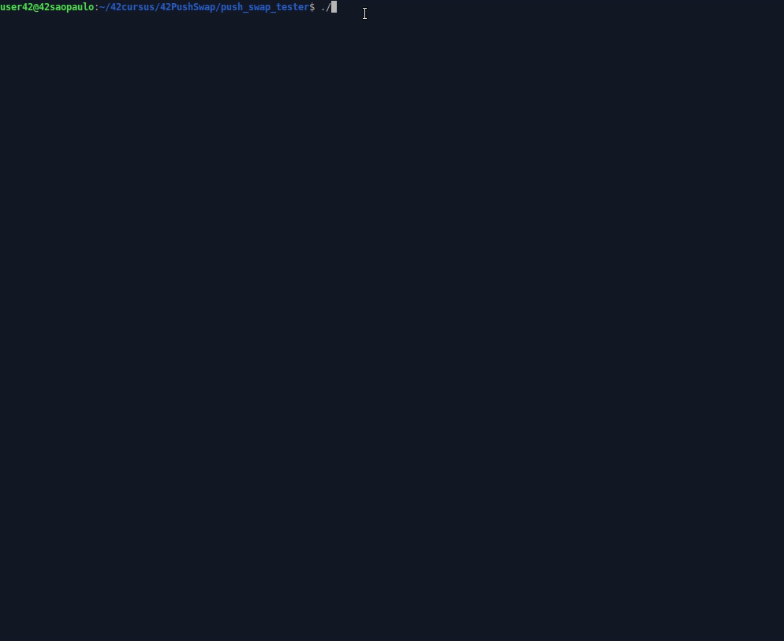

# 42PushSwap  

## About
This project will make you sort data on a stack, with a limited set of instructions, using
the lowest possible number of actions. To succeed you’ll have to manipulate various
types of algorithms and choose the one (of many) most appropriate solution for an
optimized data sorting. </br></br>
The Push_swap project is a very simple and highly effective algorithm project: data will
need to be sorted. You have at your disposal a set of int values, 2 stacks and a set of
instructions to manipulate both stacks.</br></br>
</br>
(by [Hemsi Game](https://phemsi-a.itch.io/push-swap))</br></br>
Your goal ? Write a program in C called push_swap which calculates and displays
on the standard output the smallest program using Push_swap instruction language that
sorts the integer arguments received.</br></br>
I choose [Radix Sort](https://www.youtube.com/watch?v=nu4gDuFabIM) due its brilhant resolution and due to its complexity (O (n log(n)), same as QuickSort, in the middle case. [see](https://pt.stackoverflow.com/questions/56836/defini%C3%A7%C3%A3o-da-nota%C3%A7%C3%A3o-big-o#:~:text=A%20ideia%20da%20nota%C3%A7%C3%A3o%20Big,%2C%20genericamente%2C%20por%20n%20))</br></br>
Use like this:
```
$ make
$ ./push_swap {{int_numbers}}
$ (You can use an script to shuffle: ARG=$(ruby -e "puts (-50..49).to_a.shuffle.join(' ')") (To shuffle 100 numbers, for example)
$ ./push_swap $ARG
```
</br>

*Note: If you want to view the stacks, use the print_to_terminal.c function in the debbug folder. Just include the file name in the Makefile, the function definition in the .h file and use it inside the order_\* functions, at the end, before releasing the stacks, if any. (free_stack command)*. </br></br>
*Important: For testing, don't print the stack, just the commands. That is, don't use the print_to_terminal.c function (That's exactly why it wasn't included, but left as gift)*.
</br></br>

## Testing: </br>

### To test with checker:
```
$ ARG=$(ruby -e "puts (0..499).to_a.shuffle.join(' ')")
$ ./push_swap $ARG | ./checker_linux $ARG
```
### To test by peer's test:
(by [Lais Arena](https://github.com/laisarena)) </br></br>
</br></br>
## Visualizing: </br>
(by [O-reo](https://github.com/o-reo/push_swap_visualizer), in the range [-50, 50]) </br></br>

## Ckeck 42norm: </br>
(by [42School_norm](https://github.com/42School/norminette/blob/master/pdf/pt_br.norm.pdf)) </br></br>

