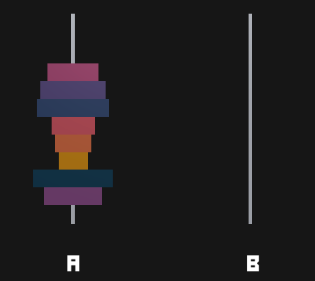
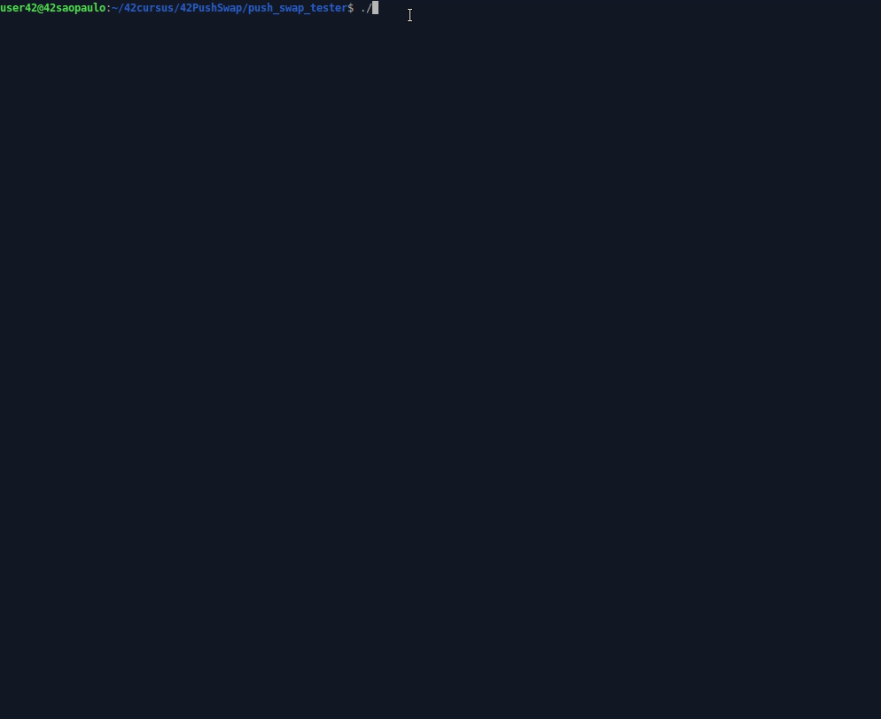

# 42PushSwap 

## About   
This project will make you sort data on a stack, with a limited set of instructions, using
the lowest possible number of actions. To succeed you’ll have to manipulate various
types of algorithms and choose the one (of many) most appropriate solution for an
optimized data sorting.   
The Push_swap project is a very simple and highly effective algorithm project: data will
need to be sorted. You have at your disposal a set of int values, 2 stacks and a set of
instructions to manipulate both stacks.  
 
(by [Hemsi Game](https://phemsi-a.itch.io/push-swap))  
Your goal ? Write a program in C called push_swap which calculates and displays
on the standard output the smallest program using Push_swap instruction language that
sorts the integer arguments received.  
I choose [Radix Sort](https://www.youtube.com/watch?v=nu4gDuFabIM) due its brilhant resolution and due to its complexity (O (n log(n)), same as QuickSort.)  

## Testing:  
(by [Lais Arena](https://github.com/laisarena))   
  
## Visualizing:  
(by [O-reo](https://github.com/o-reo/push_swap_visualizer))   

## Ckeck 42norm:  
(by [42School_norm](https://github.com/42School/norminette/blob/master/pdf/pt_br.norm.pdf))   

